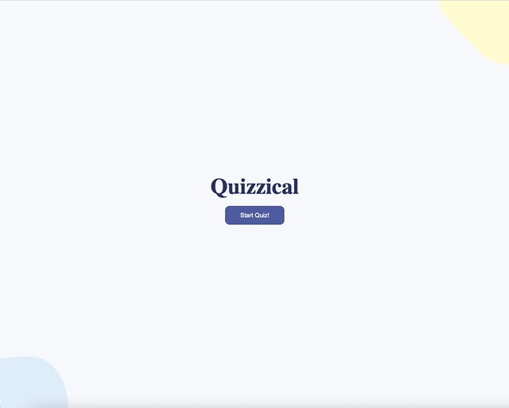

## React Quizical Game

This is a project based on Scrimba's frontend developer career path

## Overview

The goal of this project was to practice everything I've learned about React and create a fun and engaging game using Open Trivia DB API 

### Screenshot

- 

### Link 

- [Live Site](https://whimsical-snickerdoodle-59ad33.netlify.app)

### Built with 

- CSS
- React
- API (Open Trivia DB API)
- NPM (UUID4, htmlentities)